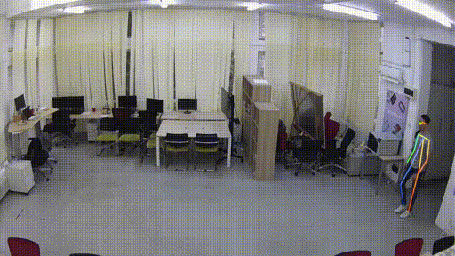
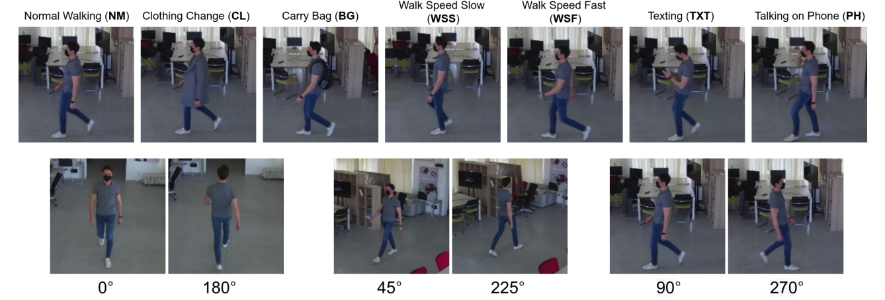
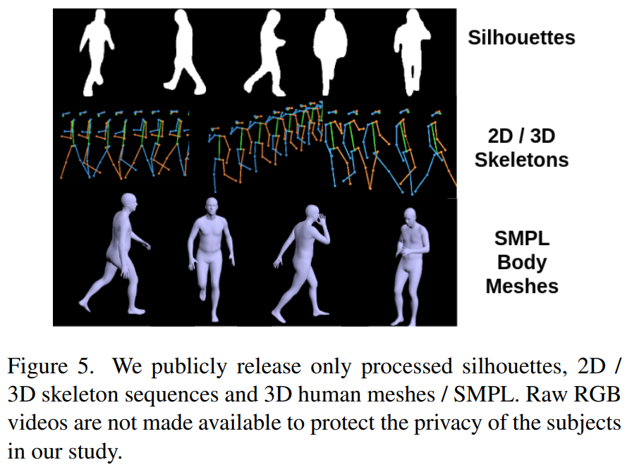
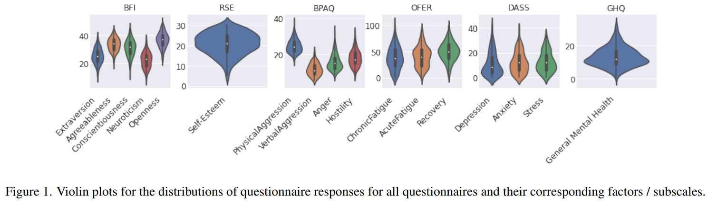
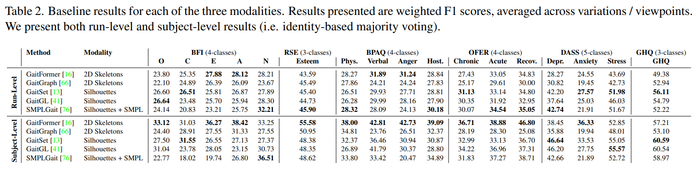

<h1 align="center"><span style="font-weight:normal">PsyMo: A Dataset for Estimating Self-Reported Psychological Traits from Gait</h1>
<h3 align="center"><span style="font-weight:normal">Accepted at: Winter Conference on Applications of Computer Vision (WACV) 2024 </h3>

<p align="center"> <a href="https://arxiv.org/abs/2308.10631"> 📘 Paper Link </a> | <a href="https://bit.ly/3Q91ypD"> 💾 Dataset Link </a> | <a href="https://arxiv.org/abs/2308.10631">  Papers With Code </a></p>

<div align="center">
<strong> Authors </strong>: <a href="https://scholar.google.com/citations?user=cdYk_RUAAAAJ&hl=en"> Adrian Cosma</a>, <a href="https://scholar.google.com/citations?user=yjtWIf8AAAAJ&hl=en">Emilian Radoi </a>
</div>

<div></div>

<div align="center">
  
</div>

## <a name="purpose"></a> 💾 Dataset Download

You can download "PsyMo" at this link: https://bit.ly/3Q91ypD 

PsyMo Dataset is intended for:
1. Psychological Attribute Estimation from Gait
2. Gait Recognition (drop-in replacement for similar datasets like e.g. CASIA)
3. Gender Estimation from Gait

If you use PsyMo, please [cite](#citation) us.

## <a name="abstract"></a> 📘 Abstract
*Psychological trait estimation from external factors such as movement and appearance is a challenging and long-standing problem in psychology, and is principally based on the psychological theory of embodiment. To date, attempts to tackle this problem have utilized private small-scale datasets with intrusive body-attached sensors. Potential applications of an automated system for psychological trait estimation include estimation of occupational fatigue and psychology, and marketing and advertisement. In this work, we propose PsyMo (Psychological traits from Motion), a novel, multi-purpose and multi-modal dataset for exploring psychological cues manifested in walking patterns. We gathered walking sequences from 312 subjects in 7 different walking variations and 6 camera angles. In conjunction with walking sequences, participants filled in 6 psychological questionnaires, totalling 17 psychometric attributes related to personality, self-esteem, fatigue, aggressiveness and mental health. We propose two evaluation protocols for psychological trait estimation. Alongside the estimation of self-reported psychological traits from gait, the dataset can be used as a drop-in replacement to benchmark methods for gait recognition. We anonymize all cues related to the identity of the subjects and publicly release only silhouettes, 2D / 3D human skeletons and 3D SMPL human meshes.*

## <a name="camera-setup"></a> 📹 Camera Setup for Gait Aquisition / Gait Variations

Alongside the standard array of covariates which includes normal walking (NM), changing clothing (CL), carry bag (CB) and walking speed (in our case walking speed slow - WSS and walking speed fast - WSF), we also introduce two covariates that are often ignored in the literature, but nevertheless appear frequently in the wild, dual-tasks, which have been shown to produce walking variability in adults. We introduce walking while texting (TXT) and walking while talking on the phone (PH). In total, our dataset contains 7 walking variations. For each variation, participants were asked to walk a round-trip, in a comfortable manner. For the normal walking variation, participants walked two round-trips. Consequently, participants walked for a total of 48 walks from 7 variations and 6 viewpoints (3 × 4 NM + 3 × 2 × 6 other variations).

<div align="center">
  
</div>

**Available Modalities** In order to preserve the anonymity of the participants, we do not release the full RGB videos, and instead choose to release only high-level features related to gait: silhouettes, 2D / 3D human poses and 3D human meshes (Figure 5). We chose state-of-the-art pretrained models that have especially good performance in ”in the wild” 
 cenarios, which are arguably more complex than our laboratory conditions: more people, filmed at a distance, with detection overlap. As such, we make a reasonable assumption that the resulting semantic data (skeletons / silhouettes) is of high quality. However, we are committed to maintaining the dataset’s quality, and we intend to update the semantic features 
 with improved models over time, if necessary. 

<div align="center">
  
</div>
 

## <a name="dataset"></a> 🔮 Psychological Questionnaires

To gather our dataset, we asked volunteers to fill in 7 psychological questionnaires and personal information about their body composition: age, gender, height and weight. After submitting the questionnaires, participants were required to have their walk captured in various conditions. All participants are physically healthy and do not report any injury or
disability affecting their walking. Participants were dressed in everyday clothes. In total, 312 subjects participated in our study, mostly university students. All participants were explicitly informed about how their data is being processed and that the anonymized dataset is made available to the research community at large. Subsequently, all participants gave explicit consent to be part of this study before filling in the questionnaires. Moreover, this study was approved by the Ethics Review Board at the University Politehnica of Bucharest (AC01/01.10.2021).

As opposed to other similar works, we have a more diverse set of questionnaires, which correspond to indicators of personality (BigFive, Rosenberg Self-Esteem), fatigue (OFER), aggressiveness (Buss-Perry Aggression Questionnaire) and mental health (General Health Questionnaire, Depression, Anxiety and Stress Scale). For the participants’ convenience, we chose the short version of the questionnaires when possible, resulting in a total completion time of approximately 30 minutes for all questionnaires. Since all our subjects are native Romanians, we used translations for each questionnaire when available. In case a translation is not available, we performed the translations with the help of a psychologist. Before capturing the walking videos, each participant was required to fill in the questionnaires. Of the 312 participants, 113 were female and 199 were male, with an average age of 21.9 years (SD = 2.18). The average weight for the participants is 70.5kg (SD = 15.7), with an average height of 174.8cm (SD = 8.9), corresponding to an average BMI of 22.87 (SD = 3.9). We briefly describe the motivation and technical details of each psychological questionnaire.

<div align="center">
  
</div>

## <a name="dataset"></a> 📈 Baselines

For psychological traits estimation on PsyMo, we propose two evaluation methodologies: **(i) run-level** and **(ii) subject-level**. For **run-level** evaluation, the model performance is evaluated for each walking sequence, irrespective of the subject. Performance in terms of precision, recall, weighted F1 score should be reported for all combinations of walking variations and viewpoints. This protocol is similar to a typical gait classification task (i.e. input walking sequence, output classes). For **subject-level** evaluation, the goal is to correctly identify the psychometric attributes for each subject, considering all available variations or runs. For instance, a naive baseline for subject-level evaluation is to use the run-level model and report the majority predicted classes for a questionnaire for all the runs of a subject. Methods for subject-level evaluation may consider the identity of the subject to be known at test time - a scenario possible in the real-world, as a part of a larger pipeline for gait recognition and classification. The same metrics as in run-level evaluation should be used.

Below we present results for psychological trait estimation for silhouettes and 2D Skeletons using popular methods.

<div align="center">
  
</div>

## <a name="citation"></a> 📖 Citation
If you found our work useful or use our dataset in any way, please cite our paper:

```
@InProceedings{cosma2023psymo,
    author    = {Adrian Cosma and Emilian Radoi},
    title     = {PsyMo: A Dataset for Estimating Self-Reported Psychological Traits from Gait},
    booktitle = {Proceedings of the IEEE/CVF Winter Conference on Applications of Computer Vision (WACV)},
    month     = {January},
    year      = {2024},
}
```

## <a name="license"></a> 📝 License

This work is protected by [CC BY-NC-ND 4.0 License (Non-Commercial & No Derivatives)](LICENSE).
